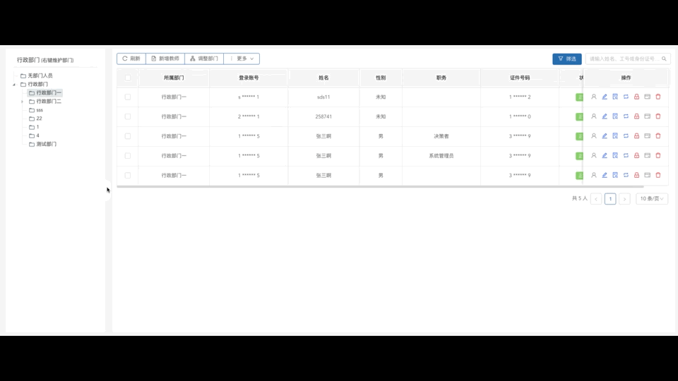

# 弹性侧边栏
可伸缩的弹性侧边栏vue组件，效果类似阿里云控制台

### 效果演示


### 参数列表
参数名 | 含义 | 数据类型 | 默认值 | 示例 |
---- | ---- | ---- | ---- | ----
siderWidth | 侧边栏宽度（单位:px） | Number | ```200``` |```300```

### 使用
```vue
<template>
  <sider-container :sider-width="300" style="height: 100vh"><!-- 实际业务中，height根据页面布局来确定 -->
    <template slot="sider">
      <!-- 这里填充侧边栏内容（如菜单） -->
    </template>
    <template slot="content">
      <!-- 这里填充页面内容 -->
    </template>
  </sider-container>
</template>

<script>
  import SiderContainer from 'sider-container'

  export default {
    components: {
      SiderContainer
    }
  }
</script>
```

### 使用示例
[example.vue](./src/example/example.vue)

### 注意事项
- sider区域和content区域均未设置内容溢出规则，请根据设计图自行添加。
